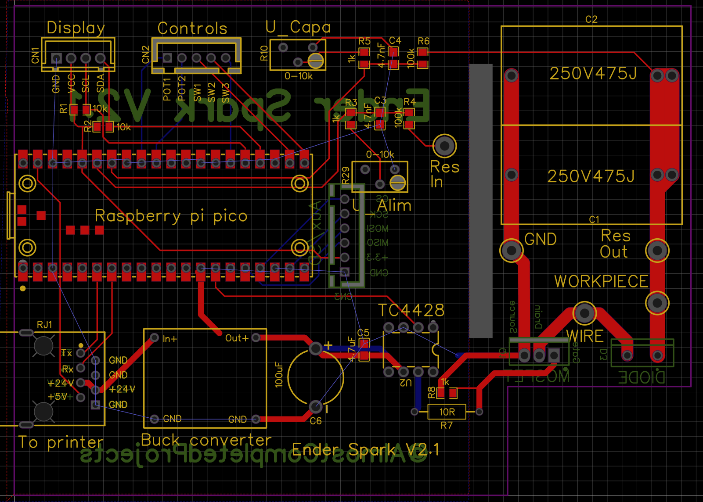
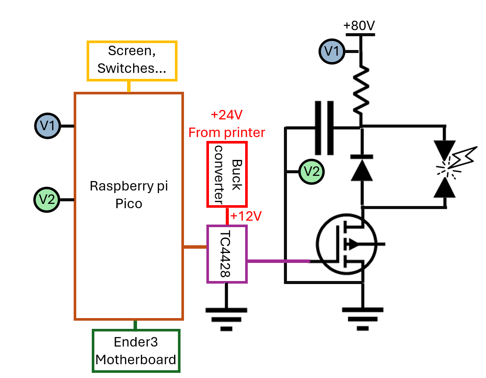

# WireEDM

Wire EDM uses electrical discharges to cut any conductive materials (brass, steel, aluminium even tungsten carbide) with no mechanical forces, enabling high precision, deep cuts, and machining of hard or delicate materials without deformation. 
This project show how to build a DIY wire EDM machine using salvaged components from an old 3D printer and other affordable parts, keeping the total cost around 250€ + 4 machined parts the ender 3 and less than 50h of work (if everything goes right).

The machine's motion system is just an Ender 3  with 1:51 gear reductions on the X and Y axes. This is required for EDM because it's a slow process and and NEMA 17 on their own are too fast.
A Raspberry Pi Pico with a TC4428 and a powerful MOSFET are used to switch up to 10A at 60KHz

The toolpath generation is simplified to be user friendly and a small tutorial is available on this video: https://youtu.be/iLnna7q0drs?si=ul4SjGQGCm429spJ

And a complete tutorial will be added on the same channel in a few months.

The conversion from a 3D printer to a wire EDM can be done in 6 steps:
- Mechanical modifications
- Wire feeder
- Firmware update
- Ark generator
- Water loop
- Fusion 360 post processor

The overall cost is about 225€ without the 3D printer separated in 3 cathegories:
- Electronics ~50€
- Mechanical parts ~115€
- Water managment ~80€

All required filles are/will be availlable here:
- Firmware for ender3V2 and modification lists here [List](Firmware/Modifications_list)
- [Post processor for fusion 360](Code/EnderSpark.cps)
- [GRBL files](PCB/Gerber_Enderspark_PCB_Enderspark_2_2026-01-28.zip) and [design files](PCB) with screenshots
- Mechanicals parts as .STEP (so you can modify it) are not up to date but will be availlable [here](step_files)
- .svg files to laser cut the [water container](Parts/Water-container.svg)

# WARNiNGS
The voltage is higher than the SELV in wet conditions, I don't know exactly how dangerous it is but please consider that it's a lethal risk and prepare yourself accordingly. If you don't know what your doing please don't try to replicate this project.

Copper is considered as a heavy metal, the best way to deal with the dirty water is to let it sit for a while in a ventilated area to evaporate all the water, after that it's jsut metal powder and can be disposed in the local recycling center.

This machine can generate a lot of EMF, it can be an issue if you have a heart assistance and it can perturb some electronics. Smartphones laptop and expensive stuff are usually safe but the screen of the ender 3 is glitching a lot, it's just the screen not the control so nothing to worry about.

# Mecanical parts
## Motion

| Part | Quantity | Cost per lot |
|- | - | - |
| Linear rail MGN12H 300mm | 1 | 10€ |
| Screws | 50 | 10€ |
| lead screw (T8,2mm picth, 2mm lead)| 2 | 15€ |
| Anti backlash nut | 2 | 3€ |
| GT2 pulley 60teeth 8mm bore | 2 | 3€ |
| Belts | 2 | 4€ |
| Hybrid bearings | 2 | 12€ |
| Bearings | 4 | 4€ |
| PLA 200g | 1 | 4€ |
| Aluminium parts | 1 | 50€ |
| Total |  | 115€ |

A big advantage of wire EDM compared to CNC milling is that the frame doesn't need to be very stiff, the hardware just need to support the wire feeder on the X axis and the water tank ~4kg on the Y axis. The Z axis isn't used during the cutting process but it's quite usefull to help changing the wire.

I've added a linear rail (MGN12H) on X and Y axis, it can be bolted directly on X axis with T nuts and for the why axis you need to drill 4 holes in the buildplate support, thats all.

Wire EDM can be very slow depending on the thickness so one of the most important requirement is to be able to move slowly at a fixed rate. Regular stepper motors aren't able to do that, even with microstepping I made a fully printable belt reducer 1:64 but it need some improvements so I've just brought gearbox for nema 17 that can be directly connected to a 2GT pulley.
They cost 20€ each and have some backlash so it's far from the best solution.

## Wire feeder

The wire feeder is the only complicated part which need to be custom made because it needs to fullfill a few requierments:
- Stifness, during the cutting process the arcs can generate vibrations, to achieve a good surface finish the wire need to be very straight
- Electrically insulated, even if the cutting is done under de-ionised water, some electrolysis can occur which can reduce the power output. An insulated feeder also prevent from shorts if a metal part fall between the wire and the feeder
- Grounded, at 60kHz the long wire is a big antenna which can emit a lot of parasites and damage electronics. Grounding as much part as possible is crucial to avoid that (and any risk for pacemaker users)
- Tensionner mechanism, to avoid wire vibration the wire need to be adequatly tensionned.
- Waste spool, wire edm consume the workpiece AND the wire, depending on the material it can use a lot of wire
- Hard wire guide, I you have an old ender 3 you've probably experience filament grinding the extruder even if its plastic against plastic, the same thing can happend here with soft brass

This is the CAD of the second version, the extruder (nema 17 + a brass cylinder) is pulling the wire all the way from the tensionner. 
The tensionner conssit of two ball bearing pressing into each other like a 3D printer extruder, the sping can be adjust to block more the wire and provide more tension.
A standard value of tension for a 0.25mm wire is 18N, I don't have an easy way to measure it for now. Maybe I can link the tension with the resonance frequency and use an audio app for calibration.

Then, the wire need to be guided very precisely, for the upper guide I use an off the shelf rubis nozzle. A water jet is used to evacuate the chips, the nozzle is printed in pla, the pressure is not that high. The lower guide is a ceramic ball bearing with a PLA spacer and a .4mm brass nozzle to push the wire against the spacer. The two other ball bearings (ceramic for the lower one and steel with plastic cover for the upper one) just guide the wire to the extruder.

The ball bearings needs to be in ceramic for three reason:
1. Corosion
2. No lubricant can desovle in water
3. High hardness
4. Electrical insulation 

The wire is connected to the (-) terminal of the PSU by the brass wheel and in the future a tungsten carbide contact block, but since the wire emit EMF like an antenna, I want to ground as much metal as I can, so the whole motor assembly is at the same potential as the wire, but the frame of the printer and the red part are grounded. The voltage arent high so a layer of epoxy or an anodization is enougth to insulate the two regions.

The first version on the left use a lots of printed parts, it works but the tensionner some part can flex and reduce the wire tension/straightness so I made a second version in 5mm thick alluminium plate with 10mm thick tensionners.

All the parts are availlable in .sldprt and .step

### Manufcaturing

Both the red and orange parts are 5mm thick aluminium cutted with my homemade CNC with a 3.175mm single flute endmill, the geometry is a bit complex and can be improve but if you want to make it there is a catch. The two parts are electrically insulated and need to be very straight, there is two options for insulating metalic coating. 
- Anodisation of aluminium + galvanic varnish, it requier sulfuric acid and other chemicals and it's not that easy to make a thick and strong coating
- Powder coating, there's a few hobbist projects but it involve fine powder which isn't better than sulfuric acid.

Both can be DIY or manufacturer by a chinese company like jlcpcb or whatever, in the case of powder coating, the frame can be made out of steel (not stainless) wich will give way more stifness. 

The two other aluminium parts doesn't need any coating same for the brass wheel, it's just a cylinder with 3 holes.

### Spool

Wire edm as you can guess consume wire, so I need a simple way to manage the waste wire. My solution is to have the new spool of wireconnected to the waste spool with magnet so the second one can be drived by the first one. Since the first spool will get smaller and smaller and the second bigger and bigger, the first one will have to turn way fater to maintain a tension. With this configurtion, the first spool has a way smaller inner diameter which made it spin fzster at any moment. The magnets act like a clutch to maintain constant load at variable speeds.

# Electronics
## generator

| Part | Quantity | Cost per lot |
|- | - | - |
| TC4428 | 2 | 4€ |
| IRF135B203 (or similar) | 2 | 5€ |
| Freewheel diode | 2 | 3€ |
| 4.7uF Polymer capacitor | 5 | 5€ |
| Buck converter (pump) | 1 | 2€ |
| Buck converter (board) | 1 | 2€ |
| Oled screen | 1 | 3€ |
| Connectors | 1 | 10€ |
| Wire diodes resistors | 1 | 5€ |
| Raspberry pi pico  | 1 | 5€ |
| Alluminium box | 1 | 10€ |
| Total |  | 50€ |

It's actually pretty easy to make an arc for EDM, it won't be as powerfull as a commercial machine but pretty close. We just need to switch a powerfull MOSFET on and of very fast, I use the IRF135B203 wich can handle 135V 129A and 500A peak. A freewheel diode is placed in parallel of the arc to protect the mosfet from reverse current generated by the inductance of the wire. The mosfet is drived by a TC4428 with a schotcky diode to protect the IC a square pwm signal is generated by the pi pico, the pico code is optimised to generate the wave as fast as possible. We also have a DC-DC converter because we need 12V to drive this mosfet. I measure the voltage accross the power resistor with 2 divider which gives me the average current in the resistor and the voltage charge of the capacitors. The close loop controle is based on the average current, if it's lower than a defined value we increase the speed otherwise we're slowing down. If the capacitor voltage is dropping, we slow down dramatically and if it's low for more than 5s the process is stopped.

## Power managment 

The power supply should be able to deliver at least 5A, 48V is enougth to cutt alluminium but a higher voltager means a higher energy stored in the capacitors (E = 1/2C U²). If you plan to cut copper or steel you can buy a switch mode power supply with adjustable output (mine can go up to 110V).

In the best case scenario, each pulse will create an arc and remove some matter but in realitty sometimes the wire is too far to create a spark and sometimes the wir eis in direct contact and will create a (momentary) short circuit. A short can be detected by the voltage/current measurement and if so the cutting is stopped.

Last part is the capacitors, it helps deliver high current durring short amount of time. You can't use some standard electrolitic capacitor (belive me I tried) ceramic is a good option but we need very low ESR so polymer is the only suitable option. In my setup I use 2x 4.7uF in parallel so ~10uF rated for 200V.

# Water

| Part | Quantity | Cost per lot |
|- | - | - |
| 24V membrane pump | 1 | 15€ |
| PC/PS/PMMA plate 50X50X5mm | 1 | 15€ |
| PM12 pneumatic connector | 1 | 5€ |
| OD12 ID10 PVC tube | 3m | 5€ |
| Bottle filter 10" | 1 | 20€ |
| Filter cardrige | 1 | 5€ |
| 1/2" -> 10mm barbed fitting | 1 | 2€ |
| PC6 M8x1.25 connector | 1 | 3€ |
| 6mm pneumatic pipe | 2m | 3€ |
| 4mm silicone tube | 0.5m | 1€ |
| Silicone seal cartridge | 1 | 5€ |
| Total |  | 80€ |

The EDM process must be done under a dielectric fluid, it can be ethanol, oil or kerosene but the easyest solution is obviously deionised water. Water is also used for cooling (the electrical components and the workpiece) and chip evacuation. The "builtplate" is a water tank made out of acrily sheets welded with aceton and a bit of silicone for etancheity. I've also add a steel shit so I can quickly remove it from my magnetic buildplate.

EDM generate a ton of small metalic particles which needs to be filter during the cutting, The best pump I've found is a membrane pump which can provide high pressure (necessary for good filtration) and is quite silent when underpowered, it's design for 24V and I power it between 5-7V depending on the material. The filter is a standard polyester coton filter <0.1um in a cardrige in the future I'll probably try washables filters like ceramic or stainless steel. I use push pull and 6mm tubes for all my connection except for the nozzle its a 4mm.

After each cuts I put the deionised water in it's original tank for decantation, and separate the "pure" water from the dirty one a few days later.

Copper is consiered as a heavy metal, the best way to deal with the dirty water is to let it sit for a while in a ventilated area to evaporate all the water, after that it's jsut metal powder and can be disposed in the local recycling center.

The water VAT was generated with:
https://www.makercase.com/basicBox

# Firmware modifications
A few modifications of the firmware are requiered and listed [here](Firmware/Modifications_list)
The configuration.h, configuration_adv.h and pins.h for an ender3V2 are also availlable [Ender3V2](Firmware/Ender3V2)

Basically we disable everything related to temperature management, enable UART2 to communicate with the pi pico (which require 2 precise solders and 2 traces cut on the motherboard).
We also need to configure a second output fan which can be enabled by M106 for the waterpump on the old output port of the nozzle. 

# Toolpath generation

The two easiest ways to generate a gcode is with a slicer or with a cam plugin. I've tried kirimoto which have a wire edm mode but there's very little features and you can't control the extruder. I've also tried cura, the limitation is that you can't set a very small speed, I even tried modifiyng the software but I coulnd'nt find a solution, maybe with orca slicer?

In my opinion the easyest solution is to use the CAM part of fusion 360 with the laser/waterjet mod. 

It's easy to setup a waterjet tool with 0.3mm stream and you can add a very long lead in to enter the workpiece from anywhere. You don't have to worry about feeds and speeds here, you just need to set all the hight to zero to avoid Z movements, and set up the appropriate thickness.

Then you need to select the wire edm [post processor for fusion 360](Code/EnderSpark.cps), I modified the wazer post processor to match my needs, I will not detail it here, the file is in this folder, you just have to paste it in the appropriate location.

I have a very small database for differents materials, so if the thickness is right, just selec the material and it should be good to go. It's an ongoing project soyou will probably have sligly differents settings than me, I'll recommand you to do a speedtest for the material you're planing to cut and modify the database:

surfacespeed is the speed in mm²/min, which correspond to the linear speed for a defined thickness ex: 3mm/min for 10mm thick aluminium is 30mm²/min.
wirespeedpermm is the wire consumed per mm² with the previous example of 30mm²/min and 25mm it will consume 750mm of wire to cut this amount of material in 1min.

A cheap 100m of 0.2mm joaillery brass wire (2€) will last for more than two hours ~0.02€/m, a more expensive 5kg of edm 0.25mm brass wire (110€) is almost 12km so ~0.01€/m and 250h of use.
In the future I will try molybdenum wire which is just a bit more expensive but it can be used several times but I need to design a back and forth drive.

Some more commun supply are also needed like heat shrink tube, solder, wires (I use wires from old RJ45 cable it can handle something like 5A without a problem, its free nd easly accessible).

A lots of tools are needed to work properly:

- Soldering iron
- Drill press
- Caliper
- Dial indicator
- Heat gun
- A good square rule
- Handed metal saw 
- Metal band saw (if your alumiun extrusions needed to be with a perfect 90° angle)
- Hand drill
- Center punch
- Marker for metal
- Hammer, clamps, screw drivers others hand tools
- 3D printer
- deburr tool

